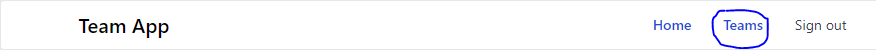
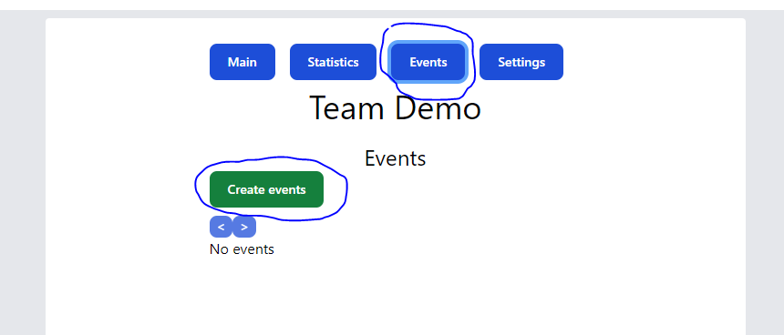
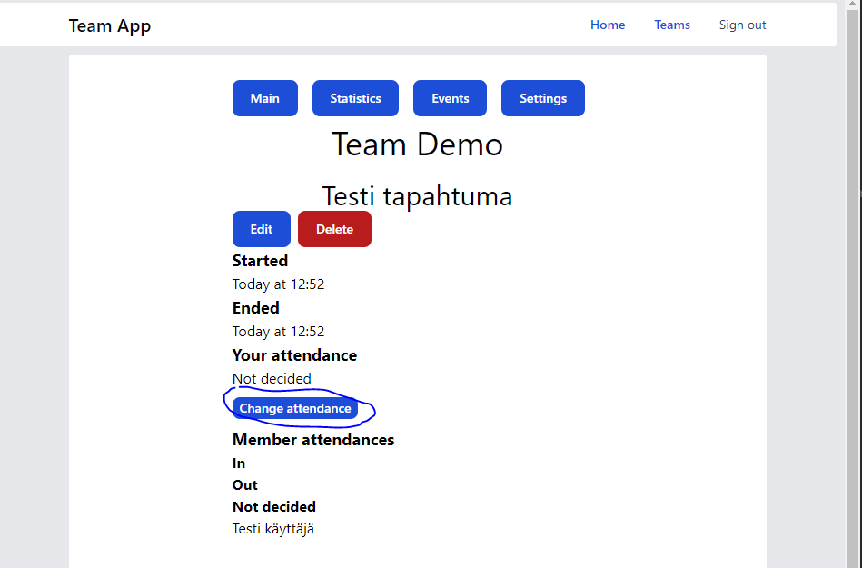

# Usage instructions

The app is for teams, mainly sports teams, to manage their events.

To use the app, one needs an account.

The app landing page has a Sign In button, if user is not logged in. By pressing the button, a sign in modal opens. User can create an account by pressing "Create account" from the modal.

## Whats new?

For the second return, I have refactored the code and implemented some new features. These features are:

- A calendar, from which one can view their events. Events can also be edited from the calendar.  
- Event types. One can create event types for a team. Event types can have different colours, to distinguish them from the calendar
- Team News. Admin of a team can create Team News, which can be read from the Team Main page.

## After signing in

The rest of the instructions expect that user has logged in.

### Create a team

Go to teams page:

Press create a new team. 

Submit the new team. 

Note! There is some bug in the heroku environment, where a complain about unique key is made. Submit again if this happens.

### Create events for the team

Go to page of the team and go to events tab. Note that you must be atleast Admin to create events.

Press Create events

After creating the event, you are redirected to the events page.

### Creating event types

One can create event types for a team from team events page.

### Mark event attendance

Mark your event attendance from the events' page

### Joining a team

One needs a join link to join an existing team. The join link can be found from the teams' main page. (Only visible to admins and owner).

One can test joining a team via this link:

[https://lehtoneo-team-app.herokuapp.com/#/teams/join/221d0c49-ae4d-4158-8bb4-15229f8c9afd](https://lehtoneo-team-app.herokuapp.com/#/teams/join/a6f2fe8c-f625-4704-87e7-7c695ba0a90c)

### Team settings

#### Discord webhook

A discord webhook can be saved for the team. When given a valid discord webhook and turning discord notifications on, information about events are sent to the webhook.

#### Join link

One can regenerate join link. This makes the old link(s) invalid. 

#### Roles

One can edit member roles in the team settings page. One can also delete members from the team. Member can only edit and delete members that have lower role than themselves. The roles currently are MEMBER, ADMIN and OWNER. 

### Other features

There are some other features in the application, such as event editing and deleting, but I will not go through them in detail, as they are quite self explanatory. 

Upcoming events can be viewed from /my-events page.

